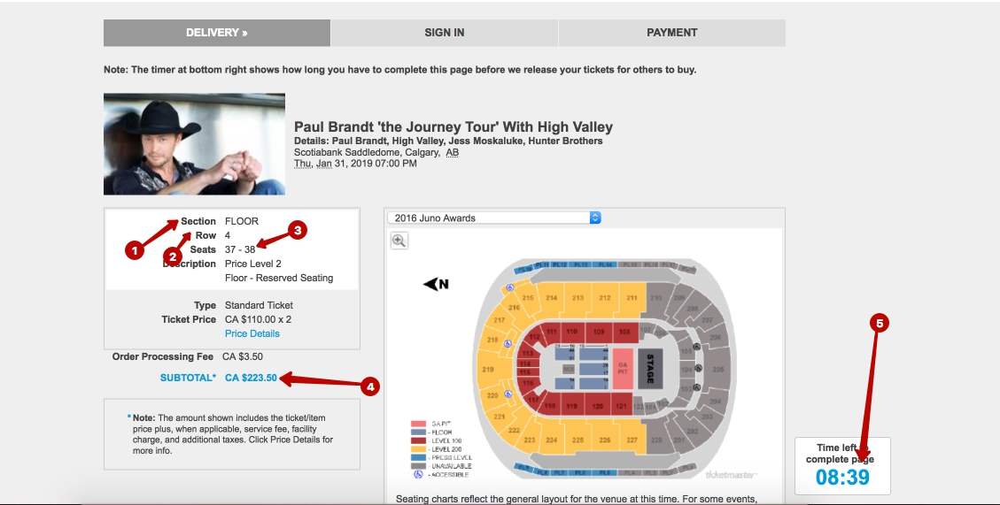

# selenium_parsing
Требуется распарсить
[данную страницу](./res/10000_-----Ticketmaster%20Delivery.htm)
и получить section, row, seats, price и прочие данные о билете.

На скрине отмечено:

1. Версия Python >=3.6
1. selenium or re (это модуль для работы с регулярными выражениями)
